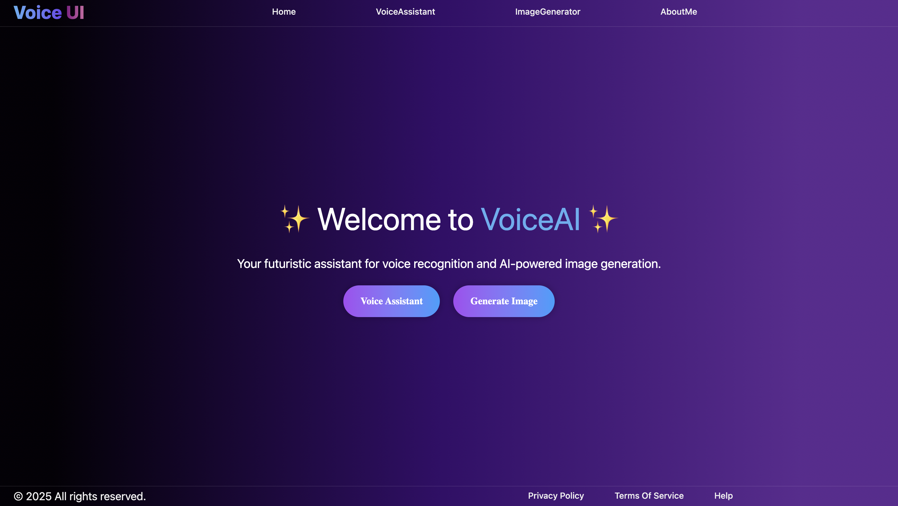
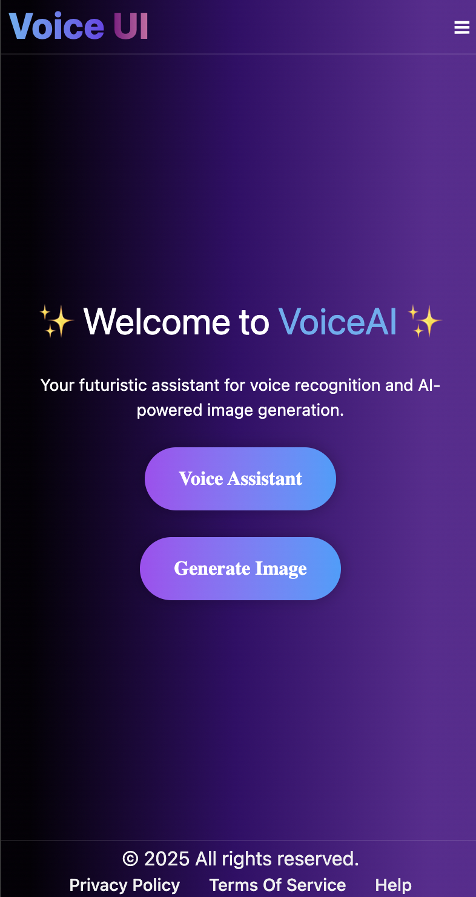

# 🎙️ VoiceAI – Voice Assistant & AI Image Generator

VoiceAI is a futuristic **React.js web app** that combines **speech recognition, AI chat, text-to-speech, and image generation** into one seamless experience.  
Users can **talk to an AI assistant**, get real-time responses, and even **generate AI-powered images** with either text or voice prompts.

---

## 🚀 Live Demo
[](https://voiceassistant-imagegenerator.netlify.app/)

---

## ✨ Features

- 🎤 **Voice-to-Text Chat Assistant**  
  - Real-time speech recognition (Web Speech API).  
  - AI responses powered by **OpenAI GPT models**.  
  - AI replies are spoken back to the user with text-to-speech.  

- 🖼 **AI Image Generator**  
  - Generate images with **DALL·E 3 API**.  
  - Voice input support → describe with speech to generate images.  
  - Smooth preview with loading states.  

- 📱 **Modern UI**  
  - Responsive design (mobile/tablet/desktop).  
  - Gradient styling + glassmorphism + animations.  
  - Dynamic navigation with **React Router**.  

- 🔗 **Extra Pages**  
  - Home, About Me, Contact links with Email, LinkedIn, GitHub.  
  - Reusable **Navbar, Footer, Mobile Menu** with smooth routing.  

---

## 🛠 Tech Stack

- **React.js** (Vite + JSX)  
- **JavaScript (ES6)**  
- **React Router** for navigation  
- **Tailwind CSS** + custom animations  
- **Shadcn/ui** for styled buttons and components  
- **OpenAI APIs**  
  - Chat Completions API (GPT-3.5 Turbo)  
  - Image Generation API (DALL·E 3)  
- **Web Speech API** for voice recognition  
- **Web Speech Synthesis API** for text-to-speech  
- **Netlify** (Hosting & Deployment)  

---

## 🖥️ Screenshots

| Desktop | Mobile |
|--------|--------|
|  |  |

---


## 🚦 Getting Started

### 1️⃣ Clone the Repository
```bash
git clone https://github.com/your-username/voiceai-app.git
cd voiceai-app
```

### 2️⃣ Install Dependencies
```bash
npm install
```

### 3️⃣ Add Environment Variables
```bash
VITE_OPENAI_Voice_KEY=your_openai_api_key
VITE_OPENAI_Image_KEY=your_openai_api_key
```

### 4️⃣ Run the App
```bash
npm run dev
```
